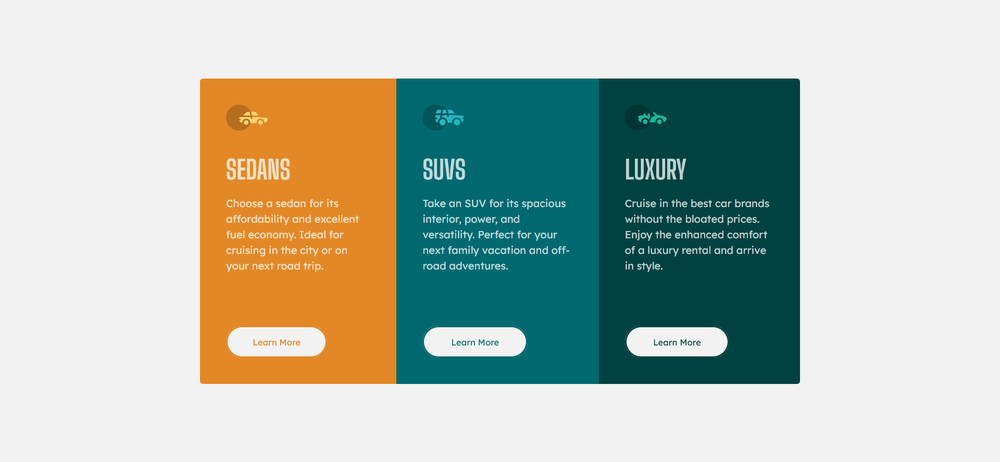

# Frontend Mentor - 3-column preview card component solution

This is a solution to the [3-column preview card component challenge on Frontend Mentor](https://www.frontendmentor.io/challenges/3column-preview-card-component-pH92eAR2-). Frontend Mentor challenges help you improve your coding skills by building realistic projects. 

## Table of contents

- [Overview](#overview)
  - [The challenge](#the-challenge)
  - [Screenshot](#screenshot)
  - [Links](#links)
- [My process](#my-process)
  - [Built with](#built-with)
  - [What I learned](#what-i-learned)
  - [Continued development](#continued-development)
  - [Useful resources](#useful-resources)
- [Author](#author)

## Overview

### The challenge

Users should be able to:

- View the optimal layout depending on their device's screen size
- See hover states for interactive elements

### Screenshot

### Links

- Solution URL: [https://github.com/cisneConCorbata/frontendMentor-columnsPreview](https://github.com/cisneConCorbata/frontendMentor-columnsPreview)
- Live Site URL: [https://cisneconcorbata.github.io/frontendMentor-columnsPreview](https://cisneconcorbata.github.io/frontendMentor-columnsPreview)

## My process

### Built with

- Semantic HTML5 markup
- CSS custom properties
- Flexbox
- CSS Grid

### What I learned

- How to create grids with CSS and set the rows/grids dimensions.

### Continued development

- CSS Grid

### Useful resources

- [CSS Grid Layout](https://www.w3schools.com/css/css_grid.asp) - It goes over CSS Grid elements.

## Author

- Website - [Add your name here](https://cisneconcorbata.github.io/cisnesPortfolio/)
- Frontend Mentor - [@cisneConCorbata](https://www.frontendmentor.io/profile/cisneConCorbata)